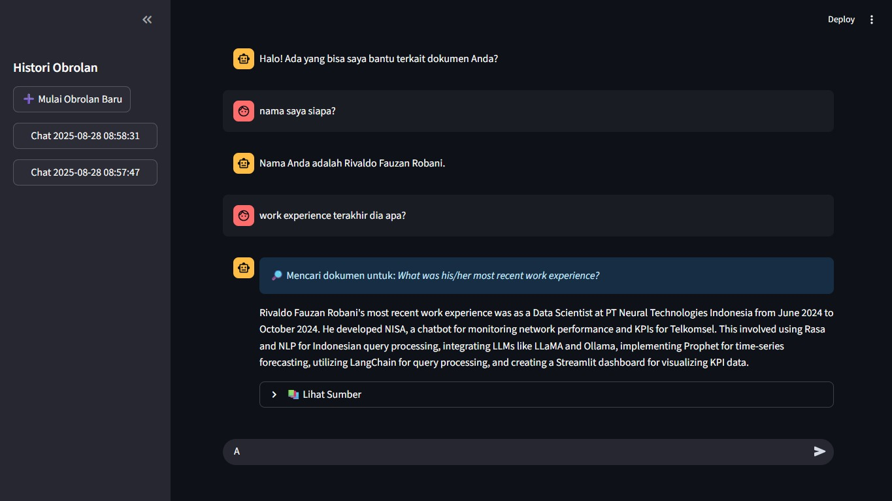
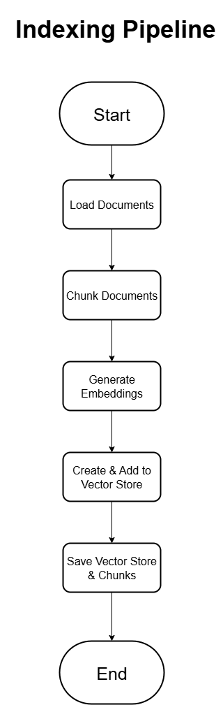

# 🧠 Contextual RAG Chatbot with Internal Documents

**Submission for the NoLimit Indonesia — Data Scientist Hiring Test**

This project is an advanced chatbot implementation using a **Retrieval-Augmented Generation (RAG)** architecture. It's designed to answer questions based on a private collection of documents (PDFs). The chatbot is powered by the **Google Gemini API** for state-of-the-art text understanding and generation, and it's capable of maintaining conversational context for a more natural and intuitive user interaction.

---

## ✨ Key Features

-   **Document-Based Q&A**: Provides accurate answers grounded in the information available within the provided PDF documents, significantly reducing the risk of model hallucination.
-   **Contextual & Conversational**: Understands follow-up questions (e.g., "what about last year?") by analyzing the previous chat history to form a coherent, standalone query.
-   **Chat Session Management**: Features a modern user interface with a sidebar for creating new chats and accessing previous conversation histories, similar to the experience on ChatGPT or Gemini.
-   **Clear Sourcing for Answers**: Every answer is accompanied by clear citations, including the source filename and page number from the documents used to generate the response.

---

## ⚙️ Architecture and Workflow

The system operates on two primary pipelines: **Indexing (Offline)** and **Querying (Online)**.

1.  **Indexing Pipeline (Offline)**: This is a one-time process to build the knowledge base. The PDF documents are loaded, split into smaller chunks, converted into numerical vectors (embeddings), and stored in an efficient vector database (FAISS) for fast retrieval.
2.  **Querying Pipeline (Online)**: When a user asks a question, it is first transformed into a standalone query based on the conversation's context. This transformed query is then used to retrieve the most relevant document chunks from the FAISS index. Finally, these chunks and the chat history are passed to the Gemini API to generate a final, contextual answer.


*Ensure your `flowchart.png` file is in the root directory for this image to display.*

---

## 🚀 Tech Stack

-   **Backend & Logic**: Python 3.10
-   **Web Framework**: Streamlit
-   **LLM (Generation & Reasoning)**: Google Gemini 1.5 Flash API
-   **Embedding Model**: `sentence-transformers` (`paraphrase-multilingual-MiniLM-L12-v2`)
-   **Vector Store**: FAISS (Facebook AI Similarity Search)
-   **Document Processing**: LangChain, PyPDF

---

## 🛠️ Setup and Installation

Follow these steps to run the project locally.

1.  **Clone the Repository**
    ```bash
    git clone https://github.com/rivaldofauzan/nolimit-ds-test-Rivaldo-Fauzan-Robani.git
    cd nolimit-ds-test-Rivaldo-Fauzan-Robani
    ```

2.  **Create and Activate a Conda Environment**
    ```bash
    conda create --name nolimit_rag python=3.10
    conda activate nolimit_rag
    ```

3.  **Install Dependencies**
    ```bash
    pip install -r requirements.txt
    ```

---

## 🔑 API Key Configuration

This project requires a Google Gemini API Key.

1.  Get your API Key from [Google AI Studio](https://aistudio.google.com/).
2.  In your project's root directory, create a new folder named `.streamlit`.
3.  Inside the `.streamlit` folder, create a new file named `secrets.toml`.
4.  Add your API key to the file in the following format:
    ```toml
    # .streamlit/secrets.toml
    GEMINI_API_KEY = "PASTE_YOUR_API_KEY_HERE"
    ```

---

## ▶️ How to Run

The application is run in two stages:

1.  **(One-Time Only) Build the Knowledge Index**
    Place your PDF files inside the `/data` folder. Then, run the following script to process them.
    ```bash
    python build_index.py
    ```
    This command will create a `vector_store/` directory containing your knowledge index.

2.  **Run the Streamlit Application**
    Once the index has been successfully built, run the web application:
    ```bash
    streamlit run app.py
    ```
    The application will automatically open in your web browser.
---

## 📸 Application Demo

*It is highly recommended to add a screenshot of your running application here to provide a visual overview.*



---

## 📸 Flowchart



---

Created by **Rivaldo Fauzan Robani**

[](https://opensource.org/licenses/MIT)